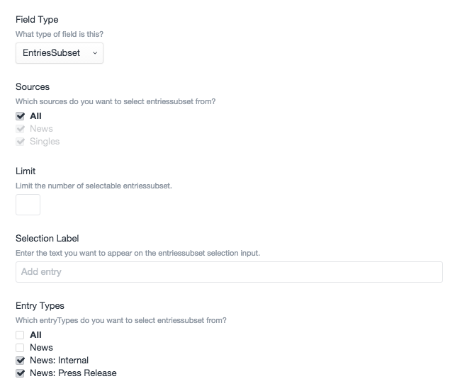

# Entries Subset plugin for Craft CMS

Craft field type plugin that extends the core Entries field type to give extra settings

## Installation

To install Entries Subset, follow these steps:

1. Download & unzip the file and place the `entriessubset` directory into your `craft/plugins` directory
2.  -OR- do a `git clone https://github.com/nfourtythree/entriessubset.git` directly into your `craft/plugins` folder.  You can then update it with `git pull`
3. Install plugin in the Craft Control Panel under Settings > Plugins
4. The plugin folder should be named `entriessubset` for Craft to see it.  GitHub recently started appending `-master` (the branch name) to the name of the folder for zip file downloads.

Entries Subset works on Craft 2.4.x and Craft 2.5.x.

## Entries Subset Overview

This field type is an extension of the built in `Entries` field type. It allows you to specify extra criteria (currently only `EntryType`) in which to restrict the available entries for selection.

As an example you might have a News section which has a few entry types. One of the entry types is "Press Release", you may then have a block where you would like the user to be able to select a "Featured" press release. With the standard `Entries` field type they would be able to select anything from the News section, with this plugin you are able to only allow the selection of those with the "Press Realse" entry type.

## Using Entries Subset

When creating a new field the extra options for `EntryType` will appear when selecting `EntriesSubset` fieldtype

## Entries Subset Roadmap

* Tidy all the things
* Show / hide entry types based on sections selected
* Make it more obvious what the criteria is when selecting entries in the ElementSelectorModal

## Entries Subset Changelog

### 0.5.0 -- 2016.02.17

* Initial release

Brought to you by [nfourtythree](http://n43.me)